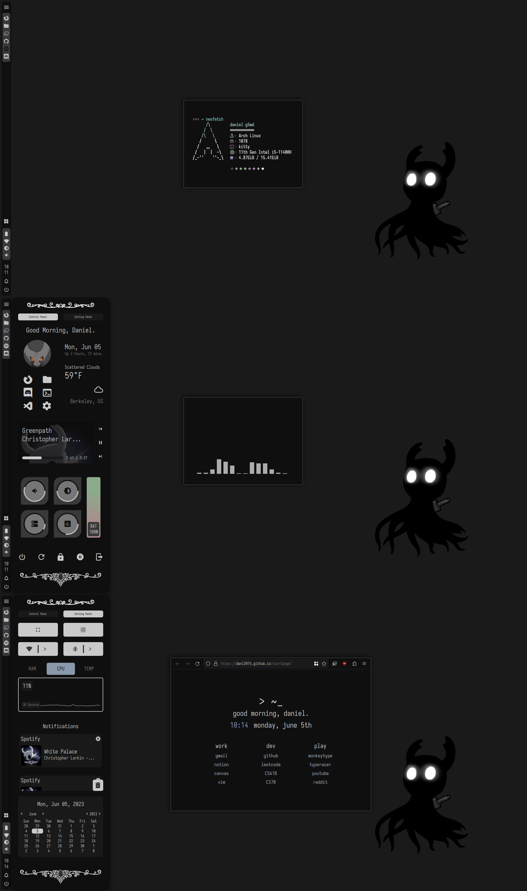

# EWW-Widgets



## My personal EWW config.<br>

Credits:<br>
Notification logger.zsh script from [Syndrizzle](https://github.com/Syndrizzle)<br>
Weather script from [adi1090x](https://github.com/adi1090x)

## Fonts

These fonts are required for the icons. If you want to change them, edit the variables `$mat-icon-font` and `$nerd-icon-font`<br>
Iosevka Nerd Font<br>
Material Iconic Design Font<br>

## Installation

Drag the `vertical-bar` folder into `$HOME/.config/eww`. To start the bar, run the `bar.sh` file.

## Reminders

Remember to chmod all the scripts.<br>
Ex: `sudo chmod +x /path/to/scripts`

Change the launcher button to your own rofi config <br>

Add your own Openweather API Key from [here](https://home.openweathermap.org/api_keys) by signing in and creating a new API key (the name of the key doesn't matter)<br>

Follow the steps below to get notifications to work. <br>

## Notifications

Notifications rely on dunst scripts to work. Append the following to the end of your dunstrc (usually at `$HOME/.config/dunst/dunstrc`):

```
[logger]
summary = "*"
script = "~/.config/eww/vertical-bar/scripts/logger.zsh"

[spotify]
summary = "*"
script = "~/.config/eww/vertical-bar/scripts/media"

[spotify-icon]
appname = "Spotify"
icon = "~/.cache/temp.png"

```
